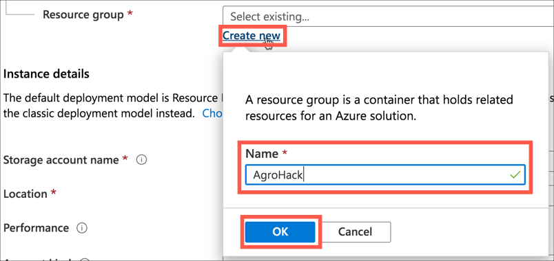
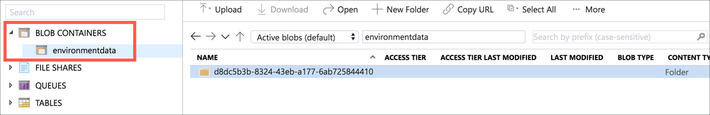

# Export data to Azure Blob storage

In the [previous step](./WriteThePiCode.md), you wrote the code to capture telemetry from the Raspberry Pi. In this step, you will export IoT telemetry to Azure Blob Storage.

## Azure blob storage

[Azure blob storage](https://azure.microsoft.com/services/storage/blobs/?WT.mc_id=agrohack-github-jabenn) allows you to store blobs of unstructured data that can be easily access from other Azure services, such as Azure ML Studio. Azure IoT Central has an export facility that can stream the telemetry data in to Azure Blob storage for processing.

Azure has a concept of [storage accounts](https://docs.microsoft.com/azure/storage/common/storage-account-overview/?WT.mc_id=agrohack-github-jabenn), which wrap a range of storage services including file, table and blob. Blob storage uses collections to store different data in.

To export data you will need an Azure account. If you don't have one, head to the [Azure Account](https://github.com/jimbobbennett/AgroHack#azure-account) instructions to create an account.

### Create a storage account and collection

There are two ways to create a storage account - from the Azure Portal or the Azure CLI.

#### Use the Azure Portal

1. Open the [Azure Portal](https://portal.azure.com/?WT.mc_id=agrohack-github-jabenn)

1. Log in with your Microsoft account if required

##### Create the storage account

1. From the left-hand menu select **+ Create a resource**

   

1. Search for `storage account` and select *Storage account - blob, file, table, queue*

   

1. Select **Create**

   

1. Fill in the details for the storage account

   1. Select your Azure subscription
   1. For the *Resource group*, select **Create new** and name it `AgroHack`, then select **OK**

      

      > Resource groups are logical groupings of Azure services, allowing you to manage all the services for a particular application or project together. At the end of this workshop this Resource Group will be deleted, deleting all the services created.

   1. Give the storage account a name. This needs to be globally unique, so include things such as the data or your name, for example `agrohackjim2020`. To make it easier, name it the same as your Azure IoT Central app.

   1. Select a *Location* closest to you

   1. Set the *Replication* to be `Locally-redundant storage (LRS)` as this is the cheapest option. For production workloads you would want better redundancy, read the [documentation on data redundancy](https://docs.microsoft.com/azure/storage/common/storage-redundancy/?WT.mc_id=agrohack-github-jabenn) for more details on this.

   1. Leave the rest of the options as the defaults

   

1. Select **Review + create**

1. Select **Create**

1. Once the deployment has completed, select the **Go to resource** button.

##### Create the collection

1. Search for `Containers` in the resource menu, and select it

   

1. Select **+ Container**

   

1. Name the container `environmentdata`. Leave the *Public access level* as `Private (No anonymous access)`. Then select **OK**.

   

#### Use the Azure CLI

##### Create the storage account

1. To install the Azure CLI, head to the [installation guide](https://docs.microsoft.com/cli/azure/install-azure-cli?view=azure-cli-latest&WT.mc_id=agrohack-github-jabenn) and follow the instructions for your OS.

1. From your terminal, log in to the Azure CLI using the following command

   ```sh
   az login
   ```

   A web browser window will be launched to allow you to log in to your Azure subscription

1. If you have multiple Azure subscriptions, you will need to select the one you want to use

   1. List all the subscriptions using the following command

      ```sh
      az account list --output table
      ```

   1. Find the subscription id of the subscription you want to use and copy it

   1. Set the active subscription using the following command

      ```sh
      az account set --subscription <subscription id>
      ```

      For the `<subscription id>`, use the id you copied in the previous step

1. Run the following command to get a list of Azure locations

   ```sh
   az account list-locations --output table
   ```

   Note the name of the location closest to you

1. Create a new Resource Group with the following command

   ```sh
   az group create --name AgroHack --location <location>
   ```

   For the `<location>`, use the name of the location closest to you.

   This will create a Resource Group called `AgroHack` in the location you specify.

   > Resource groups are logical groupings of Azure services, allowing you to manage all the services for a particular application or project together. At the end of this workshop this Resource Group will be deleted, deleting all the services created.

1. Create the storage account using the following command

   ```sh
   az storage account create \
    --location <location> \
    --name <account_name> \
    --resource-group AgroHack \
    --sku Standard_LRS
   ```

   For the `<location>`, use the name of the location closest to you.

   For the `<account_name>`, pick a name that is globally unique, so include things such as the date or your name, for example `agrohackjim2020`. To make it easier, name it the same as your Azure IoT Central app.

   The `-resource-group AgroHack` setting adds this storage account to the new Resource Group you created in the previous step.

   The `--sku Standard_LRS` setting sets the data replication to be `Locally-redundant storage (LRS)` as this is the cheapest option. For production workloads you would want better redundancy, read the [documentation on data redundancy](https://docs.microsoft.com/azure/storage/common/storage-redundancy/?WT.mc_id=agrohack-github-jabenn) for more details on this.

##### Create the collection

1. Get the account keys for the new storage account. These access keys can be used to provide access to the storage account in the CLI and create the container. Get these by running the following command.

   ```sh
   az storage account keys list \
    --account-name <account_name> \
    --resource-group AgroHack \
    --output table
   ```

   For `<account_name>` use the name you used for the storage account. The account keys are listed in the `Value` column of the output.

1. Create the collection with the following command

   ```sh
   az storage container create \
    --name environmentdata \
    --account-name <account_name> \
    --account-key <account_key>
   ```

   For `<account_name>` use the name you used for the storage account.

   For `<account_key>` use one of the keys from the previous step.

## Set up data export

Azure IoT Central can export data to a number of different services, either to route the data to multiple other services, or to store data. For example, it can send IoT messages to Azure Event Hubs, and other services can listen on these events and respond - maybe by running code to process each message.

To store telemetry data, Azure IoT Central can be connected to the blob storage container you just created, and it will save the data inside that container.

### Create the data export

1. Open the app in Azure IoT Central

1. Select **Data export** from the left-hand menu

   

1. Select the **+New** button, then select **Azure Blob Storage**

   

1. Give the export a name, such as `Export Environment Data`.

1. Select the storage account you just created, along with the `environmentdata` container.

1. Disable the export of devices and device templates

1. Select **Save**

   

1. The new data export job will appear in the list, showing a status. Wait until the status shows *Running*, this will only take about 30 seconds or so.

### Validate the data export

You can validate that data is being received via the Azure Portal, or via the CLI.

#### Validate the data with the Azure Portal

1. Open the [Azure Portal](https://portal.azure.com/?WT.mc_id=agrohack-github-jabenn)

1. Log in with your Microsoft account if required

1. If you are not on the blade for the storage account you created, search for it by typing the name of the account into the search box at the top of the portal, and selecting the storage account under the *Resources* section

   

1. From the storage account menu, select **Storage Explorer**

   

1. Expand the *Blob Containers* node, and select the *environmentdata* container. You will see a folder appear in the list for the telemetry from your device.

   

1. Double click on the folder and drill into the telemetry. It will be divided into folders by year, month, day, hour (UTC) and minute.

1. Download a `.json` file and view it in Visual Studio Code. It will contain one entry per telemetry value sent during a minute, with a time stamp, system properties and the telemetry as the body

    ```json
    {
        "EnqueuedTimeUtc": "2020-02-13T21:59:49.2860000Z",
        "Properties": {},
        "SystemProperties": {
            "connectionDeviceId": "raspberry_pi",
            "connectionAuthMethod": "{\"scope\":\"device\",\"type\":\"sas\",\"issuer\":\"iothub\",\"acceptingIpFilterRule\":null}",
            "connectionDeviceGenerationId": "637171474512477666",
            "contentType": "application/json",
            "contentEncoding": "utf-8",
            "enqueuedTime": "2020-02-13T21:59:49.2860000Z"
        },
        "Body": {
            "humidity": 58.13,
            "pressure": 99.46,
            "temperature": 16.68,
            "soil_moisture": 470
        }
    }
    ```

#### Validate the data with the Azure CLI

1. Run the following command to list the blobs stored in the storage account

   ```sh
   az storage blob list \
    --account-name <account_name> \
    --account-key <account_key> \
    --container-name environmentdata \
    --output table
   ```

   For `<account_name>` use the name you used for the storage account.

   For `<account_key>` use one of the keys used to create the collection.

1. Download the blob to a file with the following command

   ```sh
   az storage blob download \
    --container-name environmentdata \
    --name <blob_name> \
    --file data.json \
    --account-name <account_name> \
    --account-key <account_key>
   ```

   For `<blob_name>` use be the `Name` value of one of the blobs from the list output by the previous step. You will need to use the full name including the folders, such as `d8dc5b3b-8324-43eb-a177-6ab725844410/telemetry/2020/02/13/20/46/01.json`.

   For `<account_name>` use the name you used for the storage account.

   For `<account_key>` use one of the keys used to create the collection.

   This will download a file into the current directory called `data.json`. View this file with Visual Studio Code. It will contain one entry per telemetry value sent during a minute, with a time stamp, system properties and the telemetry as the body

    ```json
    {
        "EnqueuedTimeUtc": "2020-02-13T21:59:49.2860000Z",
        "Properties": {},
        "SystemProperties": {
            "connectionDeviceId": "raspberry_pi",
            "connectionAuthMethod": "{\"scope\":\"device\",\"type\":\"sas\",\"issuer\":\"iothub\",\"acceptingIpFilterRule\":null}",
            "connectionDeviceGenerationId": "637171474512477666",
            "contentType": "application/json",
            "contentEncoding": "utf-8",
            "enqueuedTime": "2020-02-13T21:59:49.2860000Z"
        },
        "Body": {
            "humidity": 58.13,
            "pressure": 99.46,
            "temperature": 16.68,
            "soil_moisture": 470
        }
    }
    ```

## Use this data

Once the data is in blob storage, it can be access and used by multiple Azure services. This workshop won't cover these use cases in depth as there are to0 many possibilities. To learn more about ways to use this data, check out the following documentation:

* [Access data in Azure storage services from ML Studio](https://docs.microsoft.com/azure/machine-learning/how-to-access-data/?WT.mc_id=agrohack-github-jabenn)
* [Access cloud data in a Jupyter notebook](https://docs.microsoft.com/azure/notebooks/access-data-resources-jupyter-notebooks#azure-storage?WT.mc_id=agrohack-github-jabenn)
* [Trigger an Azure Function when entries are added to blob storage](https://docs.microsoft.com/azure/azure-functions/functions-create-storage-blob-triggered-function?WT.mc_id=agrohack-github-jabenn)

<hr>

In this step, you exported IoT telemetry to Azure Blob Storage. In the [next step](./TriggerRule.md) you will create an Azure IoT Central rule triggered when the soil moisture is too low.
